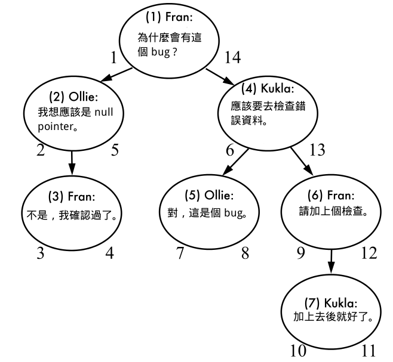
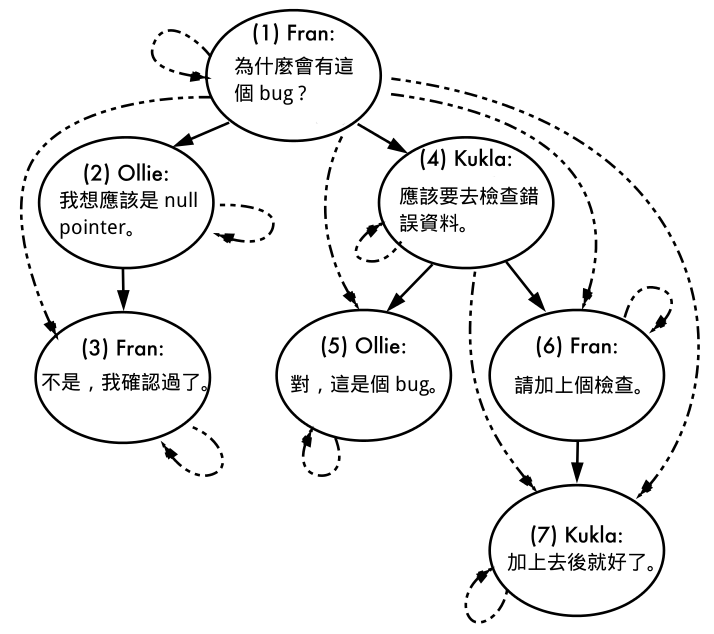

# SQL中的樹狀結構實現方法

## 前言

在開發應用程式時，樹狀結構的資料其實很常見。無論是論壇的評論系統、組織架構圖、檔案目錄結構等,都需要處理具有層級關係的資料。但當需要將這些資料存儲在關係型資料庫中時，問題就變得複雜起來。本文將介紹幾種在SQL中實現樹狀結構的主要方法，並分析它們各自的優缺點與實作困難點。

## 情境說明

讓我們以一個具體的例子來說明 - 假設我們要開發一個bug追蹤系統的評論功能。這個系統需要:

1. 使用者可以對bug發表評論
2. 使用者可以回覆其他人的評論
3. 評論可以有無限層級的巢狀結構
4. 需要能夠快速查詢某個評論的所有子評論
5. 需要能夠快速查詢某個評論的所有父評論

### 範例資料結構

```
Fran: 為什麼會有這個 bug ?
├─ Ollie: 我想應該是 null pointer。
│  └─ Fran: 不是，我確認過了。
│
└─ Kukla: 應該要去檢查錯誤資料。
   ├─ Ollie: 對，這是個 bug。
   │
   └─ Fran: 請加上個檢查。
      └─ Kukla: 加上去後就好了。
```


## 基礎資料結構

在不考慮階層關係的情況下，最基本的評論表結構如下:

```sql
CREATE TABLE comments (
    comment_id    BIGINT UNSIGNED AUTO_INCREMENT PRIMARY KEY,
    bug_id        BIGINT UNSIGNED NOT NULL,
    author        TEXT NOT NULL,
    comment_text  TEXT NOT NULL,
    created_at    TIMESTAMP DEFAULT CURRENT_TIMESTAMP,
    updated_at    TIMESTAMP DEFAULT CURRENT_TIMESTAMP ON UPDATE CURRENT_TIMESTAMP
);
```

資料範例:
```
comment_id  bug_id  author  comment_text                   created_at
------------------------------------------------------------------------
1           1234    Fran    為什麼會有這個 bug ?          2024-01-01 10:00:00
2           1234    Ollie   我想應該是 null pointer。     2024-01-01 10:05:00
3           1234    Fran    不是，我確認過了。            2024-01-01 10:10:00
4           1234    Kukla   應該要去檢查錯誤資料。        2024-01-01 10:15:00
5           1234    Ollie   對，這是個 bug。             2024-01-01 10:20:00
6           1234    Fran    請加上個檢查。               2024-01-01 10:25:00
7           1234    Kukla   加上去後就好了。             2024-01-01 10:30:00
```


## 1. Adjacency List (鄰接表)模型

### 概念
這是最直觀且最容易實現的方法。每個節點都存儲其父節點的ID。

### 資料結構
```sql
CREATE TABLE comments (
    comment_id    BIGINT UNSIGNED AUTO_INCREMENT PRIMARY KEY,
    parent_id     BIGINT UNSIGNED,
    bug_id        BIGINT UNSIGNED NOT NULL,
    author        TEXT NOT NULL,
    comment_text  TEXT NOT NULL,
    created_at    TIMESTAMP DEFAULT CURRENT_TIMESTAMP,
    updated_at    TIMESTAMP DEFAULT CURRENT_TIMESTAMP ON UPDATE CURRENT_TIMESTAMP,
    
    FOREIGN KEY (parent_id) REFERENCES comments(comment_id) ON DELETE CASCADE
);
```

### 預期資料範例
```
comment_id  parent_id   author  comment_text                  created_at
-------------------------------------------------------------------------
1           NULL        Fran    為什麼會有這個 bug ?         2024-01-01 10:00:00
2           1           Ollie   我想應該是 null pointer。    2024-01-01 10:05:00
3           2           Fran    不是，我確認過了。           2024-01-01 10:10:00
4           1           Kukla   應該要去檢查錯誤資料。       2024-01-01 10:15:00
5           4           Ollie   對，這是個 bug。            2024-01-01 10:20:00
6           4           Fran    請加上個檢查。              2024-01-01 10:25:00
7           6           Kukla   加上去後就好了。            2024-01-01 10:30:00
```

### 查詢

我們可以用 Join 靠一次查詢拿到下一階的資料

```sql
SELECT c1.*, c2.* FROM comments c1
  LEFT OUTER JOIN comments c2 ON c2.parent_id = c1.comment_id
WHERE c1.comment_id = 1;
```

可是想要一口氣查一階以上時，就得再 Join 下去

```sql
SELECT c1.*, c2.*, c3.*, c4.*
FROM comments c1                        -- 第一階
  LEFT OUTER JOIN comments c2
    ON c2.parent_id = c1.comment_id     -- 第二階
  LEFT OUTER JOIN comments c3
    ON c3.parent_id = c2.comment_id     -- 第三階
  LEFT OUTER JOIN comments c4
    ON c4.parent_id = c3.comment_id     -- 第四階
WHERE c1.comment_id = 1;
```

而且這種方式在階層數不固定時，就還要再想辦法動態產生 SQL。不然就是得要分次查詢。

部份資料庫如 PostgreSQL 有支援 Common Table Expression，可以使用 WITH 語法做到遞迴查詢，達成一次呼叫的目的。

```sql
WITH comment_tree
(comment_id, bug_id, parent_id, author, comment_text, depth)
AS (
    SELECT *, 0 AS depth FROM comments
    WHERE parent_id IS NULL
    UNION ALL
    SELECT c.*, ct.depth+1 AS depth FROM comment_tree ct
    JOIN comments c ON (ct.comment_id = c.parent_id)
)
SELECT * FROM comment_tree WHERE bug_id = 1234 WHERE commend_id = 1;
```

除此之外，一口氣將所有資料讀出來，組成樹狀資料結構後放在 cache 提供查詢也是一種妥協的方式。只是這個方法在資料量大，或者是資料常修改次數高的時候能帶來的效益也有限。

### 修改

雖然查詢很糟，可是修改樹狀結構的時候倒是十分容易。

增加一筆 comment:

```sql
INSERT INTO comments (bug_id, parent_id, author, comment_text)
  VALUES (1234, 7, 'Kukla', 'Thanks!');
```

搬移:

```sql
UPDATE comments SET parent_id = 3 WHERE comment_id = 6;
```

如果有針對外來鍵設定 `ON DELETE CASCADE` 的話，刪除也是一次做完:

```sql
DELETE FROM comments WHERE comment_id = 4;
```

### 主要困難點
1. **遞迴查詢效能**
   - 查詢深層子節點需要多次JOIN或遞迴查詢
   - 資料量大時效能下降嚴重
   - 某些資料庫不支援遞迴查詢(CTE)
   
2. **分頁處理複雜**
   - 難以實現帶有層級結構的分頁
   - 需要額外處理排序邏輯
   
3. **樹結構完整性維護**
   - 刪除節點時需要決定子節點處理方式
   - 移動節點可能造成循環參照
   - 需要額外機制防止資料不一致
   
   
### 小結

優點 :
1. 結構簡單，容易理解
2. 插入、更新和刪除操作簡單且效率高
3. 維護成本低
4. 適合處理動態變化的樹結構

缺點 :
1. 查詢子樹需要多次遞迴查詢，效能較差
2. 不易實現樹的整體操作
3. 在大數據量時查詢性能下降明顯


## 2. Path Enumeration (路徑枚舉)模型

### 概念

通過存儲完整的層級路徑來維護樹狀結構，類似檔案系統的路徑。

所謂的 Path Enumeration，指的就是將整個樹的路徑列舉出來，舉例來講，像檔案系統路徑 `/usr/share/applications` 就是一種 Path Enumeration。

在 Adjacency List 中，每一筆 comment 只知道自己上一層的資料，因此在查詢時會花費額外的功夫。Path Enumeration 透過記錄完整路徑的方式，來解決 Adjacency Lists 難以處理的狀況。表格結構上，增加了 path 這個欄位。

### 資料結構
```sql
CREATE TABLE comments (
    comment_id    BIGINT UNSIGNED AUTO_INCREMENT PRIMARY KEY,
    path          VARCHAR(1000),
    bug_id        BIGINT UNSIGNED NOT NULL,
    author        TEXT NOT NULL,
    comment_text  TEXT NOT NULL,
    created_at    TIMESTAMP DEFAULT CURRENT_TIMESTAMP,
    updated_at    TIMESTAMP DEFAULT CURRENT_TIMESTAMP ON UPDATE CURRENT_TIMESTAMP,
    
    INDEX(path)
);
```

資料:

### 預期資料範例
```
comment_id  path        author  comment_text                  created_at
------------------------------------------------------------------------------
1           1/          Fran    為什麼會有這個 bug ?         2024-01-01 10:00:00
2           1/2/        Ollie   我想應該是 null pointer。    2024-01-01 10:05:00
3           1/2/3/      Fran    不是，我確認過了。           2024-01-01 10:10:00
4           1/4/        Kukla   應該要去檢查錯誤資料。       2024-01-01 10:15:00
5           1/4/5/      Ollie   對，這是個 bug。            2024-01-01 10:20:00
6           1/4/6/      Fran    請加上個檢查。              2024-01-01 10:25:00
7           1/4/6/7/    Kukla   加上去後就好了。            2024-01-01 10:30:00
```

### 查詢

靠著 `path` 的資料，我們可以很輕易地查詢子樹狀結構：

comment 7 的所有父階：

```sql
SELECT * FROM comments AS c WHERE '1/4/6/7/' LIKE CONCAT(c.path, '%');
```

這個查詢會將 `1/`, `1/4/`, `1/4/6/` 三個父階以及自己全部查詢出來。

comment 4 的所有子階：

```sql
SELECT * FROM comments AS c WHERE c.path LIKE '1/4/%';
```

這個查詢會將 `1/4/5/`, `1/4/6/`, `1/4/6/7/` 三個子階及自己全部查詢出來。

由於查詢子樹狀結構變得十分簡單，所以套用 aggregation function 也很直接：

```sql
SELECT COUNT(*), author FROM comments AS c WHERE c.path LIKE '1/4/%' GROUP BY c.author;
```

得到

```
COUNT(*)    author
------------------
1           Fran
2           Kukla
1           Ollie
```

### 修改

為了要維護路徑，修改資料時就麻煩了。例如在 comment 7 下一層新增一筆評論：

```sql
-- 先新增資料
INSERT INTO comments (author, bug_id, comment_text) VALUES ('Ollie', 1234, 'Good job!');
-- 再更新路徑
UPDATE comments AS c, (SELECT path FROM comments WHERE comment_id = 7) AS c2
  SET c.path = CONCAT(c2.path, LAST_INSERT_ID(), '/')
WHERE comment_id = LAST_INSERT_ID();
```

搬移的話必須要將所有子階的路徑全部 update，由於每一個路徑要更新的值都不一樣，因此需要用到 CASE..WHEN 語法來動態決定更新的值。例如將 comment 4 搬到 comment 2 之下:

```sql
UPDATE comments SET path = CASE WHEN path LIKE '1/4/%' THEN REPLACE(path, '1/', '1/2/') END WHERE path LIKE '1/4/%';
```

刪除的時候因為查詢方便，所以不是問題：

```sql
DELETE FROM comments WHERE path LIKE '1/4/%';
```

### 主要困難點
1. **路徑長度限制**
   - VARCHAR欄位長度限制
   - 深層節點可能超出限制
   - 需要考慮路徑壓縮策略

2. **路徑維護開銷**
   - 移動節點需要更新所有子節點路徑
   - 大量數據時效能影響顯著
   - 需要事務保證一致性

3. **索引效率問題**
   - LIKE查詢可能無法充分利用索引
   - 需要特別設計索引策略
   - 可能需要額外的索引結構

### 小結

優點 :

1. 查詢效率高，特別是查詢子樹和祖先
2. 容易實現樹的排序
3. 支持快速的層級查詢


缺點 :

1. 依賴 LIKE 語法，索引帶來的效能改善受限於語法的使用方式。
2. 修改資料時需要維護所有子階的路徑資料。
3. 需要維護路徑的一致性
4. 路徑根據資料庫、primary key 長度等條件，可能會遇到長度限制。
5. 路徑是自己編碼過的資料，沒有辦法用外來鍵確保資料完整性。

## 3. Nested Sets (嵌套集合)模型

### 概念
使用左值(left)和右值(right)來表示樹的層級關係，基於樹的前序遍歷。

Nested Sets 是一種藉由記錄樹的 [Pre-Order Tree Traversal](http://en.wikipedia.org/wiki/Tree_traversal#Pre-order) 順序來達到記錄階層結構的方法。這個方式需要增加以下的欄位：

### 資料結構
```sql
CREATE TABLE comments (
    comment_id    BIGINT UNSIGNED AUTO_INCREMENT PRIMARY KEY,
    lft          INTEGER NOT NULL,
    rgt          INTEGER NOT NULL,
    bug_id        BIGINT UNSIGNED NOT NULL,
    author        TEXT NOT NULL,
    comment_text  TEXT NOT NULL,
    created_at    TIMESTAMP DEFAULT CURRENT_TIMESTAMP,
    updated_at    TIMESTAMP DEFAULT CURRENT_TIMESTAMP ON UPDATE CURRENT_TIMESTAMP,
    
    INDEX(lft),
    INDEX(rgt)
);
```

`nsleft`, `nsright` 指的是在 Pre-Order Tree Traversal 時，第一次和第二次經過此節點的步數。第一次經過時將步字寫在節點左邊，第二次經過時寫在右邊，最後就會形成如下圖所示的樣子。



因此資料看起來會是這個樣子：


### 預期資料範例
```
comment_id  lft  rgt   author  comment_text                  created_at
-----------------------------------------------------------------------------
1           1    14    Fran    為什麼會有這個 bug ?         2024-01-01 10:00:00
2           2    5     Ollie   我想應該是 null pointer。    2024-01-01 10:05:00
3           3    4     Fran    不是，我確認過了。           2024-01-01 10:10:00
4           6    13    Kukla   應該要去檢查錯誤資料。       2024-01-01 10:15:00
5           7    8     Ollie   對，這是個 bug。            2024-01-01 10:20:00
6           9    12    Fran    請加上個檢查。              2024-01-01 10:25:00
7           10   11    Kukla   加上去後就好了。            2024-01-01 10:30:00
```
## 查詢

有了節點左右方的數字後，就可以利用這些數字查詢子樹結構 :

```sql
-- comment 4 以及其下層的資料
SELECT c2.* FROM comments AS c1 JOIN comments as c2 ON c2.nsleft BETWEEN c1.nsleft AND c1.nsright WHERE c1.comment_id = 4;

-- 如果已經有 comment 4 的 nsleft/nsright 資料，query 可以簡化成
SELECT * FROM comments WHERE nsleft BETWEEN 6 AND 13;
```

查詢所有父階資料也沒問題 :

```sql
-- comment 6 以及其上層的資料
SELECT c2.* FROM comments AS c1 JOIN comments AS c2 ON c1.nsleft BETWEEN c2.nsleft AND c2.nsright WHERE c1.comment_id = 6;

-- 如果已經有 comment 6 的 nsleft/nsright 資料，query 可以簡化成
SELECT * FROM comments WHERE nsleft <= 9 && nsright >= 12;
```

## 修改

刪除節點是 Nested Sets 亮眼的地方，因為 `nsleft` 和 `nsright` 的數字其實不會因為數字沒有連續而導致樹狀結構出錯，只要仍然保持 pre order 的順序，所有的 query 都會保持正常。

要刪除一個節點，並將子節點往上提，只需要直接刪除該節點就好:

```sql
DELETE FROM comments WHERE comment_id = 6;
```

刪除一個節點和以下的節點也很簡單，因為已經可以輕易地查詢出子樹狀結構:

```sql
DELETE FROM comments WHERE nsleft BETWEEN 6 AND 13;
```

不過，新增和搬移節點的時候，因為需要維護 pre order 順序，因此這兩種動作就複雜了許多。以在 comment 5 下方新增節點為例：

```sql
-- 首先需要把 comment 5 之後的節點，其 nsleft/nsright 的值全部調整一次，好空出 8 和 9 這兩值來
UPDATE comments SET
  nsleft = CASE
    WHEN nsleft >= 8 THEN nsleft + 2
    ELSE nsleft
  END,
  nsright = nsright+2
WHERE nsright >= 7;

-- 之後才能新增
INSERT INTO comments (nsleft, nsright, bug_id, author, comment_text) VALUES (8, 9, 1234, 'Fran', 'Me too!');
```

不管新增或搬移，都牽涉到更新許多其他的節點的 `nsleft`, `nsright`，操作也較複雜，因此這兩種資料操作是 Nested Sets 的罩門所在。

### 主要困難點
1. **插入和移動節點複雜**
   - 需要重新計算大量節點的左右值
   - 並發操作容易產生衝突
   - 需要鎖定相關範圍的數據

2. **節點編號管理**
   - 需要定期重新編號避免數值溢出
   - 整理編號時需要鎖定整個表
   - 可能影響線上服務

3. **維護成本高**
   - 開發人員需要深入理解機制
   - 除錯相對困難
   - 需要額外的維護工具

### 小結

優點：

1. 查詢完整子樹非常高效
2. 適合讀取密集的應用
3. 支持高效的層級查詢

缺點:

1. 需要維護左右值的一致性
2. 不適合頻繁修改的數據
3. 較難理解。

## 4. Closure Table (閉包表)模型

### 概念
使用額外的表格存儲所有節點間的關係，包括直接和間接關係。

Closure Table 是將節點階層關係全部記錄下來的作法，一種空間換取時間的標準例子。這個作法把每一個節點自己和所有子節點的關係記錄在另一張表格，在查詢時當成 intersect table 使用。所以這種作法需要兩張表格：

### 資料結構
```sql
CREATE TABLE comments (
    comment_id    BIGINT UNSIGNED AUTO_INCREMENT PRIMARY KEY,
    bug_id        BIGINT UNSIGNED NOT NULL,
    author        TEXT NOT NULL,
    comment_text  TEXT NOT NULL,
    created_at    TIMESTAMP DEFAULT CURRENT_TIMESTAMP,
    updated_at    TIMESTAMP DEFAULT CURRENT_TIMESTAMP ON UPDATE CURRENT_TIMESTAMP
);

CREATE TABLE comment_paths (
    ancestor    BIGINT UNSIGNED NOT NULL,
    descendant  BIGINT UNSIGNED NOT NULL,
    
    PRIMARY KEY(ancestor, descendant),
    FOREIGN KEY (ancestor) REFERENCES comments(comment_id) ON DELETE CASCADE,
    FOREIGN KEY (descendant) REFERENCES comments(comment_id) ON DELETE CASCADE
);
```

表格資料如下 :

```
comment_id  bug_id  author  comment_text
----------------------------------------------------
1           1234    Fran    為什麼會有這個 bug ?
2           1234    Ollie   我想應該是 null pointer。
3           1234    Fran    不是，我確認過了。
4           1234    Kukla   應該要去檢查錯誤資料。
5           1234    Ollie   對，這是個 bug。
6           1234    Fran    請加上個檢查。
7           1234    Kukla   加上去後就好了。

ancestor    descendant
----------------------
1           1
1           2
1           3
1           4
1           5
1           6
1           7
2           2
2           3
3           3
4           4
4           5
4           6
4           7
5           5
6           6
6           7
7           7
```

`comment_tree_paths` 這張表格內可以看到每一個節點都有相對應的 `descendant` 資料，並把自己也當成子節點之一。下圖是節點資料的關係：



### 查詢

查詢 comment 4 與其所有子節點:

```sql
SELECT c.* FROM comments AS c JOIN comment_tree_paths AS t ON c.comment_id = t.descendant WHERE t.ancestor = 4;
```

查詢 comment 6 與其所有父節點:

```sql
SELECT c.* FROM comments AS c JOIN comment_tree_paths AS t ON c.comment_id = t.ancestor WHERE t.descendant = 6;
```

### 修改

新增一筆 comment 到 comment 7 下:

```sql
-- 新增 comment
INSERT INTO comments (bug_id, author, comment_text) VALUES (1234, 'Ollie', 'Good job!');

-- 新增 comment_tree_paths 關係
INSERT INTO comment_tree_paths (ancestor, descendant)
  SELECT t.ancestor, LAST_INSERT_ID() FROM comment_tree_paths AS t
WHERE t.descendant = 7
UNION ALL
  SELECT LAST_INSERT_ID(), LAST_INSERT_ID();
```

新增 `comment_tree_paths` 資料的方法是先查詢出有哪些節點的子節點有 comment 7，再用 union 將自己也放進去結果內，最後將查詢的結果一次建立起來。

刪除 comment 4 及之下的所有 comment 時，如果 `comment_tree_paths` 有設定 ON DELETE CASCADE:

```sql
-- 刪除 comment，連同 comment_tree_paths 都一併刪除
DELETE FROM comments WHERE comment_id IN (SELECT descendant FROM comment_tree_paths WHERE ancestor = 4);
```

或者也可以只刪除關連性，保持原本的 comment 資料

```sql
-- 只刪除關連
DELETE FROM comment_tree_paths WHERE descendant IN (
  SELECT descendant FROM (SELECT descendant FROM comment_tree_paths WHERE ancestor = 4) AS d
);
```

搬移節點則需要兩個步驟，假設要將 comment 6 搬到 comment 3:

```sql
-- 把除了自己以外，將 comment 6 當成 ancestor 和 descendant 的關連刪除
-- 會刪除 (1, 6), (1,7), (4, 6), (4, 7)
DELETE FROM comment_tree_paths WHERE
  descendant IN (
    -- 把 comment 6 當成 ancestor 的關連
    SELECT descendant FROM (
      SELECT descendant FROM comment_tree_paths WHERE ancestor = 6
    ) AS d
  )
  AND
  ancestor IN (
    -- 把 comment 6 當成 descendant 的關連, (6, 6) 除外
    SELECT ancestor FROM (
      SELECT ancestor FROM comment_tree_paths WHERE descendant = 6 AND ancestor != descendant
    ) AS a
  );

-- 利用 CROSS JOIN 將 comment 6 和 comment 3 的關連產生出來後建立
-- 會建立出 (1, 6), (2, 6), (3, 6), (1, 7), (2, 7), (3, 7)
INSERT INTO comment_tree_paths
  SELECT super.ancestor AS super_ancestor, sub.descendant AS sub_descendant FROM comment_tree_paths AS super, comment_tree_paths AS sub
WHERE super.descendant = 3 AND sub.ancestor = 6;
```

P.S : MySQL 似乎不允許 UPDATE/DELETE 時 reference 自己當條件，因此需要使用 derived table，看起來比較複雜一點。

### Closure Table 變型

如果有需要，Closure Table 還能夠透過增加記錄 ancestor 到 descendant 的階層距離，來改善需要針對特定層級拿取資料的查詢

```sql
CREATE TABLE comment_tree_paths (
  ancestor      BIGINT UNSIGNED NOT NULL,
  descendant    BIGINT UNSIGNED NOT NULL,
  path_length   INT NOT NULL, -- 新欄位

  PRIMARY KEY(ancestor, descendant),
  FOREIGN KEY (ancestor) REFERENCES comments(comment_id),
  FOREIGN KEY (descendant) REFERENCES comments(comment_id)
);
```

在此種作法中，下一階的 descendant，距離為 1，下兩階的距離為 2，以此類推。有了這些資料後，可以做如下的查詢:

comment 4 所有下一層 comment :

```sql
SELECT c.* FROM comments AS c JOIN comment_tree_paths AS t ON c.comment_id = t.ancestor WHERE ancestor = 4 AND path_length = 1;
```

comment 1 下三層的 comment :

```sql
SELECT c.* FROM comments AS c JOIN comment_tree_paths AS t ON c.comment_id = t.ancestor WHERE ancestor = 1 AND path_length <= 3;
```


### 主要困難點
1. **存儲空間開銷**
   - 需要存儲所有祖先子孫關係
   - 節點數量增長時空間消耗大
   - 需要權衡存儲成本

2. **關係維護複雜**
   - 新增/刪除節點需要維護多條關係記錄
   - 批量操作時性能影響大
   - 需要正確處理事務

3. **查詢優化難度**
   - 多表JOIN可能影響效能
   - 需要精心設計索引策略
   - 可能需要數據分片

### 小結

優點:

1. 查詢效率高
2. 支持多重繼承
3. 便於維護資料完整性
4. 適合複雜的樹操作


缺點:

1. 需要額外的存儲空間
2. 插入和刪除操作需要維護額外的關係表
3. 實現相對複雜


## 實作建議

### 選擇考慮因素
1. 數據規模與增長趨勢
2. 讀寫操作比例
3. 查詢模式分析
4. 維護難度評估
5. 開發團隊能力

### 優化策略
1. 合理使用緩存
2. 異步處理更新
3. 實施分片策略
4. 定期維護優化


## 效能比較

以下是各種方法在不同操作上的效能比較：

| 操作 | Adjacency List | Path Enumeration | Nested Sets | Closure Table |
|------|---------------|------------------|-------------|---------------|
| 讀取子節點 | O(n) | O(1) | O(1) | O(1) |
| 寫入節點 | O(1) | O(1) | O(n) | O(1) |
| 移動子樹 | O(1) | O(n) | O(n) | O(n) |
| 刪除子樹 | O(n) | O(n) | O(n) | O(1) |


## 總結

每種方法都有其適用場景：

1. **簡單應用，頻繁更新**: Adjacency List
   - 適合層級較淺的結構
   - 需要頻繁修改的場景
   - 數據量較小的情況

 2. **路徑導向應用**: Path Enumeration
   - 需要快速的路徑查詢
   - 層級結構相對固定
   - 需要支持路徑導航

3. **靜態數據，深層查詢**: Nested Sets
   - 需要頻繁查詢樹結構
   - 修改操作較少
   - 需要高效的子樹查詢

4. **複雜查詢，動態結構**: Closure Table
   - 需要支持複雜的樹操作
   - 存儲空間不是主要考慮因素
   - 需要高效的任意節點間關係查詢


